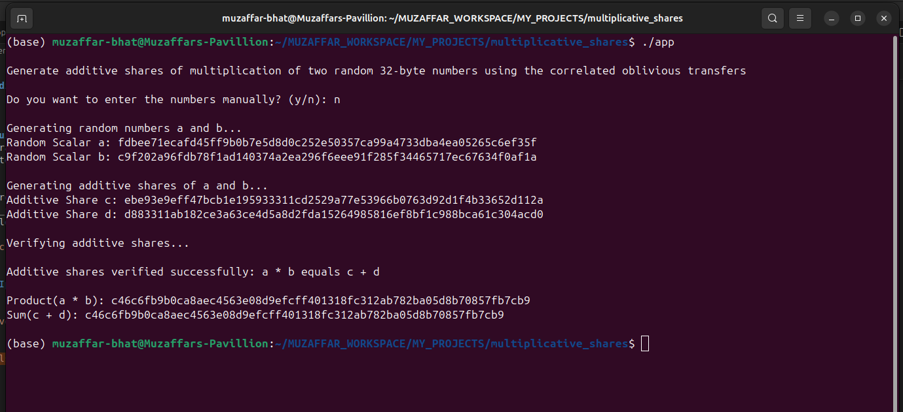
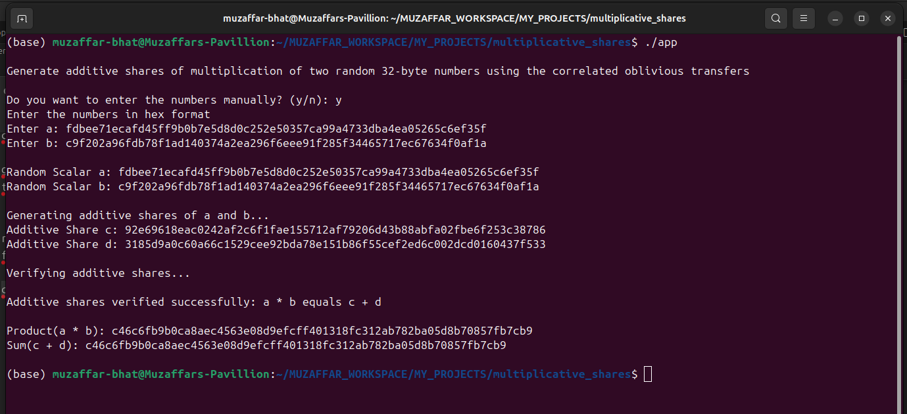

# Generate additive shares of multiplication of two random 32-byte numbers using the correlated oblivious transfers

### Usage

##### Pre-requisites
- openssl library along with its development package libssl-dev
- trezor-crypto library

##### Setup
- clone the project
- cd additive-shares
- Run the following commands
```bash
gcc -c utils.c -Ipath/to/trezor-crypto/include -Lpath/to/trezor-crypto -ltrezor-crypto -lssl -lcrypto -o utils.o
```
```bash
gcc -c ot.c -Ipath/to/trezor-crypto/include -Lpath/to/trezor-crypto -ltrezor-crypto -lssl -lcrypto -o ot.o
```
```bash
gcc -c additive_shares.c -Ipath/to/trezor-crypto/include -Lpath/to/trezor-crypto -ltrezor-crypto -lssl -lcrypto -o additive_shares.o
```
```bash
gcc app.c utils.o ot.o additive_shares.o -Ipath/to/trezor-crypto/include -Lpath/to/trezor-crypto -ltrezor-crypto -lssl -lcrypto -o app
```
```bash
./app
```

### input/output-1


### input/output-2

